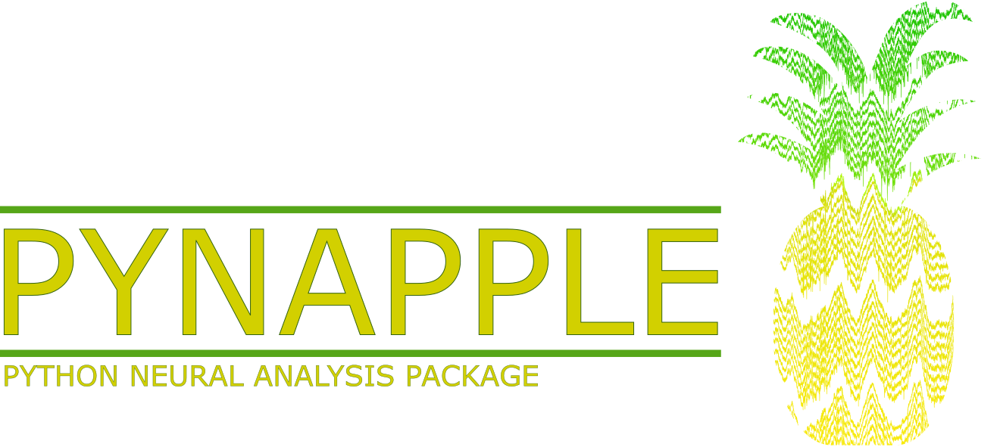

==========================

[](https://pypi.python.org/pypi/pynapple)

[](https://travis-ci.com/gviejo/pynapple)

PYthon Neural Analysis Package.

pynapple is a light-weight Python library for neurophysiological data analysis. The goal is to offer a versatile set of tools to study typical data in the field, i.e. time series (spike times, behavioral events, etc.) and time intervals (trials, brain states, etc.). It also provides users with generic functions for neuroscience such as tuning curves and cross-correlograms.

-   Free software: GNU General Public License v3
-   Documentation:
    <https://peyrachelab.github.io/pynapple>

------------------------------------------------------------------------

Getting Started
---------------

### Requirements

-   Python 3.6+
-   Pandas 1.0.3+
-   numpy 1.17+
-   scipy 1.3+
-   numba 0.46+

### Installation

pynapple can be installed with pip:

``` {.sourceCode .shell}
$ pip install pynapple
```

or directly from the source code:

``` {.sourceCode .shell}
$ # clone the repository
$ git clone https://github.com/PeyracheLab/pynapple.git
$ cd pynapple
$ # Install in editable mode with `-e` or, equivalently, `--editable`
$ pip install -e .
```

Features
--------

-   Automatic handling of spike times and epochs
-   Tuning curves
-   Loading data coming from various pipelines
-   More and more coming!

Basic Usage
-----------

After installation, the package can imported:

``` {.sourceCode .shell}
$ python
>>> import pynapple as nap
```

An example of the package can be seen below. The exemple data can be
found
[here](https://www.dropbox.com/s/1kc0ulz7yudd9ru/A2929-200711.tar.gz?dl=1).

``` {.sourceCode .python}
import numpy as np
import pandas as pd
import pynapple as nap
import sys

data_directory = 'data/A2929-200711'


episodes = ['sleep', 'wake']
events = ['1']

# Loading Data
spikes = nap.loadSpikeData(data_directory)   
position = nap.loadPosition(data_directory, events, episodes)
wake_ep = nap.loadEpoch(data_directory, 'wake', episodes)

# Computing tuning curves
tuning_curves = nap.computeAngularTuningCurves(spikes, position['ry'], wake_ep, 60)
tuning_curves = nap.smoothAngularTuningCurves(tuning_curves, 10, 2)
```

### Credits

Special thanks to Francesco P. Battaglia
(<https://github.com/fpbattaglia>) for the development of the original
*TSToolbox* (<https://github.com/PeyracheLab/TStoolbox>) and
*neuroseries* (<https://github.com/NeuroNetMem/neuroseries>) packages,
the latter constituting the core of *pynapple*.

This package was developped by Guillaume Viejo
(<https://github.com/gviejo>) and other members of the Peyrache Lab.

Logo: Sofia Skromne Carrasco, 2021.
